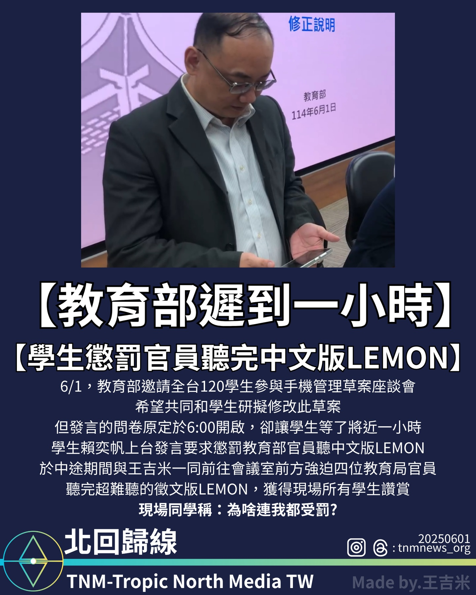

教育部座談會遲到引學生不滿　學生行動懲罰官員引發關注

2025年6月1日，教育部於台北召開「行動載具管理草案」全國學生座談會，邀請來自全台120名學生參與討論，希望能與學生共同研擬草案修正方向。

然而，原定於18:00開啟的發言問卷，因教育部官員遲到近一小時，導致學生現場等待不滿。

學生賴奕帆（@ivantw829）代表學生上台發言，當場要求懲處教育部官員。

隨後，賴奕帆與育達高中學生王吉米（@win_9487）一同前往會議室前方，

強迫四位教育局官員聽完學生帶來的中文版歌曲《LEMON》。這段抗議行動贏得現場其他學生熱烈支持與讚賞，成為此次座談會的重要插曲。

學生們透過此舉表達對行政效率及尊重的訴求，強調學生參與討論應被正視與尊重。

教育部尚未就遲到一事發表公開回應，會議後續討論仍持續進行中。
