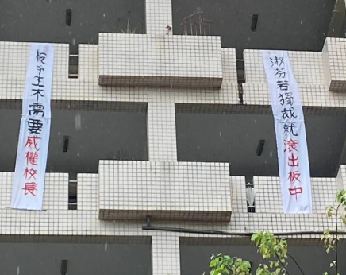

2025年5月16日，新北市板橋高中學生於校慶期間在校園內拉起布條，抗議即將於8月1日上任的新校長劉淑芬，並公開表達對校園自由與學生自治的關切。

根據新北市教育局公告，現任中和高中校長劉淑芬將調任板橋高中，引發部分學生不安。

學生指出，劉校長於中和高中任內實施嚴格手機禁用政策，並對學生自治活動有諸多限制，

擔心此風格延伸至板橋高中後，將影響校園氛圍與學生自主空間。

布條上寫有「板中不需要威權校長」、「自由魂不滅 團結來反抗」等字句，展現學生對於自主權的訴求。

### 學生透過社群平台進一步提出四項具體訴求如下：

1. 不得以行政手段集體收繳、管制或沒收學生手機或其他個人財物。  
2. 不得干涉學生自治組織（如學生會、議會、社團）之正當運作與選舉。  
3. 不得限制學生行使憲法保障之言論自由與集會結社自由。  
4. 重大校規調整（尤其涉及學生權益者），應事先公開說明並充分諮詢學生意見。

此次行動引發社會對校園民主、教育權力結構與學生參與權的關注。

不少學生表示，期望校方與教育局能正面回應學生聲音，並重視學生參與校務討論的正當性與必要性。