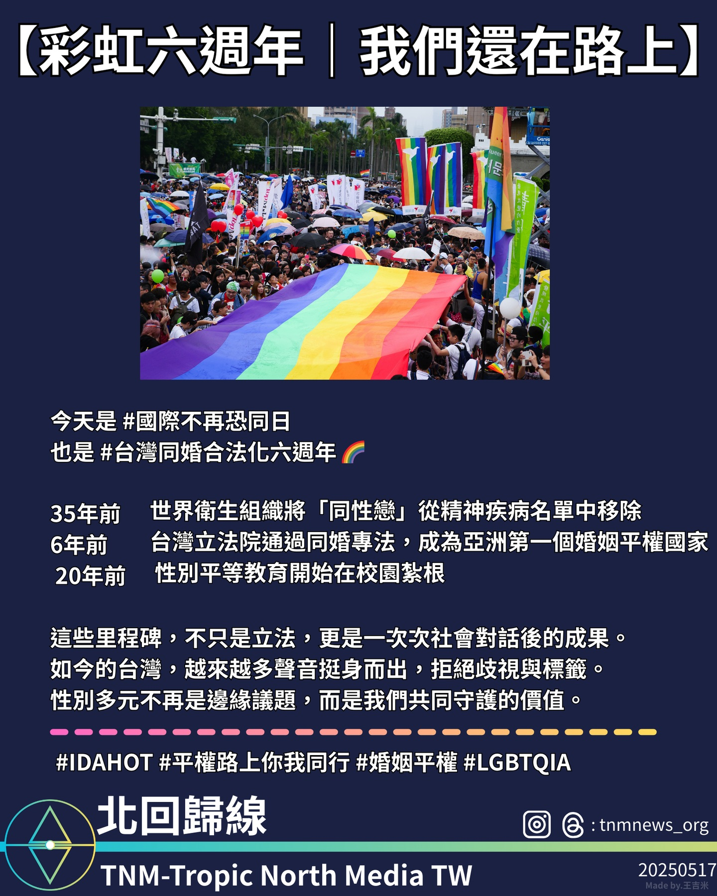

**2025年5月17日，是國際不再恐同日，同時也是台灣通過《司法院釋字第748號施行法》、實現婚姻平權的六週年紀念日。**

這一天不僅標誌著歷史，也承載著無數人持續努力的成果。

35年前，**世界衛生組織（WHO）正式將「同性戀」從國際精神疾病診斷分類中移除**，象徵對LGBTQ+群體醫療污名的終結。

20年前，**《性別平等教育法》於台灣立法通過，開始在全國校園推動性別意識教育**，讓下一代在更多元包容的環境中成長。

6年前，台灣立法院三讀通過婚姻平權專法，使台灣成為**亞洲第一個同性婚姻合法化的國家**，成為歷史性的人權里程碑。

這些制度改革背後，無一不是來自長期社會溝通與抗爭的成果。無數當事人、倡議者、家長與教育工作者，透過行動、對話與堅持，

逐步讓性別議題從邊緣走向主流，從私領域進入公共視野。

如今，台灣社會中越來越多聲音挺身而出，拒絕歧視與標籤，捍衛多元成家的權利與自由表達的尊嚴。

性別多元不再只是少數人的訴求，而是我們共同守護的民主價值。

🏳️‍🌈 **謝謝每一位在平權路上努力的你，我們還在路上，也會繼續同行。**