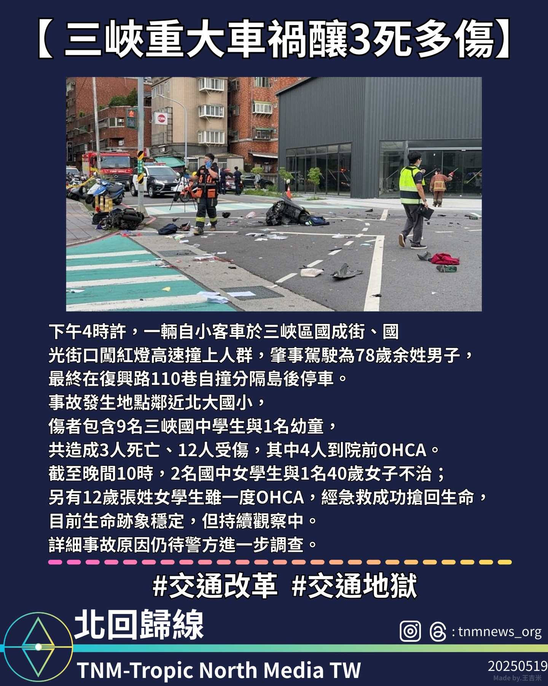

三峽區一輛小客車闖紅燈撞上人群，造成3死12傷，其中多為學生，事故原因待警方調查。

2025年5月17日下午約4時許，新北市三峽區發生重大交通事故。

一輛由78歲余姓男子駕駛的小客車，在國成街與國光街口闖紅燈高速撞向人群後，於復興路110巷自撞分隔島並停車。

事故發生地點鄰近北大國小，傷者中包含9名三峽國中學生及1名幼童，總計3人當場死亡、12人受傷，其中4人於現場發生院前心肺停止（OHCA）。

截至當晚10時，經醫療搶救仍有2名國中女學生及1名40歲女子不治身亡。

另有一名12歲張姓女學生曾發生院前心肺停止，

經急救成功恢復生命跡象，目前生命狀況穩定，仍持續觀察中。

警方表示，詳細肇事原因仍在調查中，將持續追蹤事故後續處理情況。
