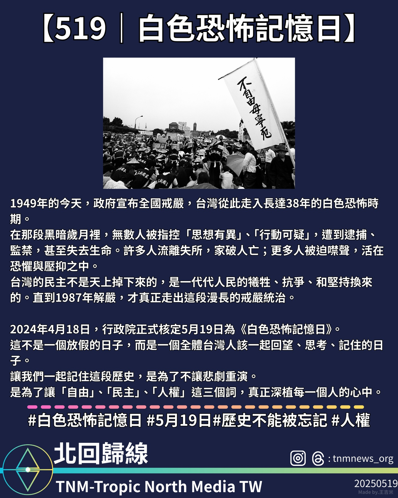

5月19日為台灣《白色恐怖記憶日》，回顧戒嚴時期黑暗歲月，提醒社會珍惜民主自由。

每年的 5 月 19 日，是台灣的《白色恐怖記憶日》。1949 年 5 月 19 日，政府宣布全國戒嚴，台灣由此進入長達 38 年的戒嚴與白色恐怖時期。

在那段黑暗歲月中，無數人因「思想異端」或「可疑行動」被逮捕、監禁，甚至失去生命。許多家庭因此破碎，無數人被迫噤聲，生活在恐懼與壓抑中。

台灣今日的民主與自由，並非自然而然，而是一代又一代人民的犧牲、抗爭與堅持換來的成果。直到 1987 年解嚴，社會才逐步走出戒嚴的陰影。

2024 年 4 月 18 日，行政院正式核定每年 5 月 19 日為《白色恐怖記憶日》，此日並非假期，而是台灣全體民眾應共同回望、反思與記取的日子。

我們紀念過去，是為了不讓歷史悲劇重演，是為了讓「自由」、「民主」與「人權」三大價值深植人心，永續傳承。

