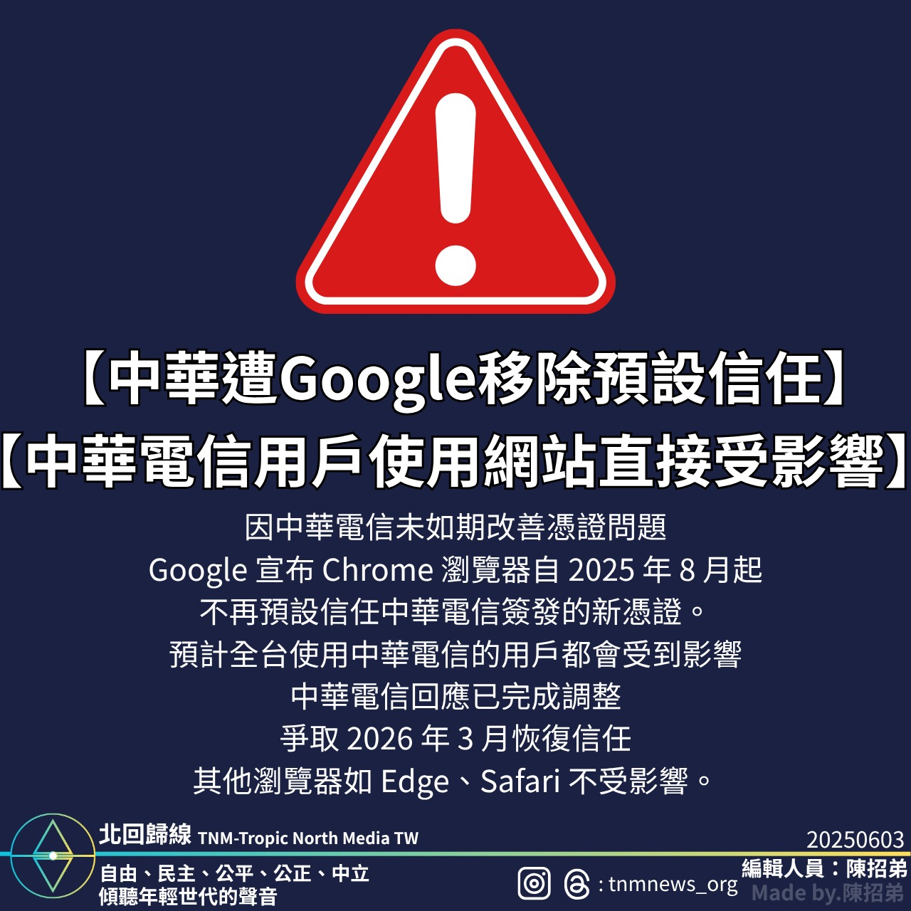

Google宣布自2025年8月1日起，Chrome瀏覽器將不再預設信任中華電信簽發的新數位憑證，影響全台用戶。

Google於2025年宣布，自2025年8月1日起，旗下瀏覽器Chrome將不再預設信任由中華電信簽發的新數位憑證。

此舉主要原因為中華電信未能在Google設定的期限內完成合規性調整，且未達成先前所承諾的改善進度。

中華電信方面則回應，目前已完成必要調整，並已符合Google的要求，計劃於2026年3月重新取得Chrome預設信任憑證的地位。

此變動將影響全台中華電信用戶的網路安全連線體驗，用戶與企業需留意後續相關影響與調整措施。

