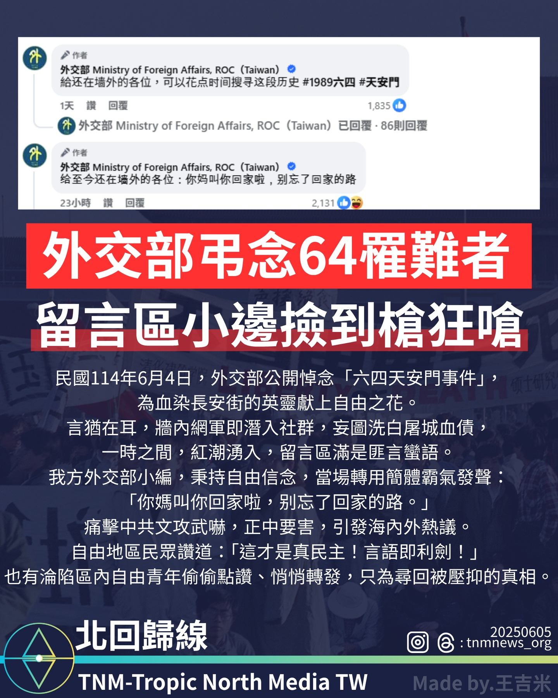

# 外交部六四弔念引發網路熱議　小編霸氣回應獲讚揚

📅 2025年6月4日  
✍️ 王吉米｜政治議題

---

外交部公開弔念六四事件罹難者，社群留言區遭網軍攻擊，官方小編以簡體字霸氣回應，引發海內外正反兩極討論。

---

## 民主悼念與言論攻防

2025年6月4日，民國114年，是六四天安門事件36周年。

台灣外交部公開發文悼念當年血染長安街的英靈，獻上自由之花，以表彰民主與人權的堅持。

不過，悼念聲明發布後，網路社群留言區隨即湧入來自境外的網軍言論，試圖為當年屠城行徑洗白，造成留言區充斥大量對立言詞。

---

## 小編回擊：言語也是利劍

外交部社群小編在面對挑釁時，轉以簡體字霸氣回應：

