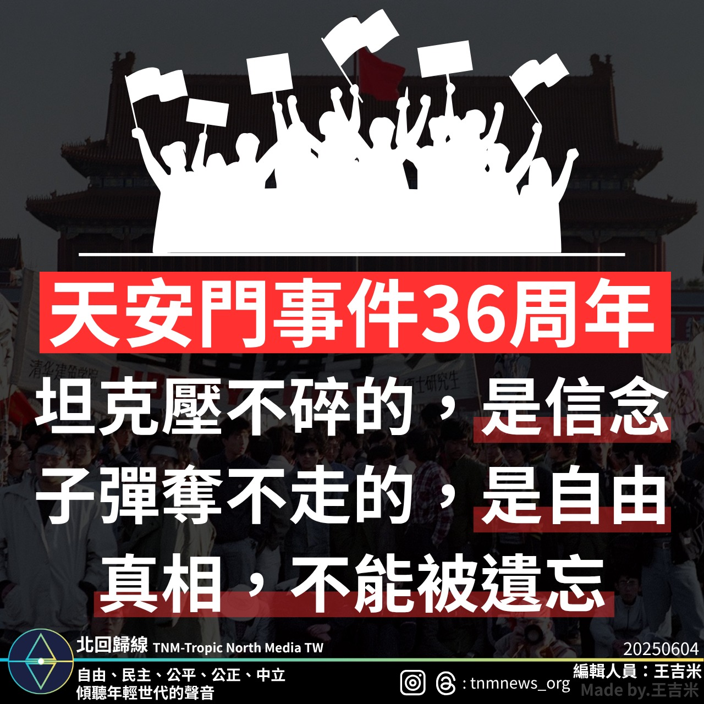

# 天安門事件36周年：記憶勇氣，守護自由

📅 2025年6月4日  
✍️ 王吉米｜專題報導

---

2025年6月4日，全球紀念天安門事件36周年，回顧學生與市民為自由抗爭的勇氣與犧牲，提醒社會不忘歷史真相。

---

## 追憶 1989：自由的代價

2025年6月4日，是天安門事件36周年紀念日。  
36年前，無數學生與市民走上北京街頭，為追求自由與政治改革發聲。

那一天，他們的勇氣彷彿坦克也無法碾碎，信念比子彈更堅韌。

然而，隨著坦克和槍聲響起，歷史被染上沉重色彩，無數生命逝去，無數家庭破碎。

---

## 記憶與責任

這段悲痛的歷史，提醒我們自由與民主來之不易。

紀念天安門事件，不是為了對抗，而是為了提醒社會不忘真相，珍惜並守護人權與自由。

> 只有記住歷史，未來才能避免重蹈覆轍。

