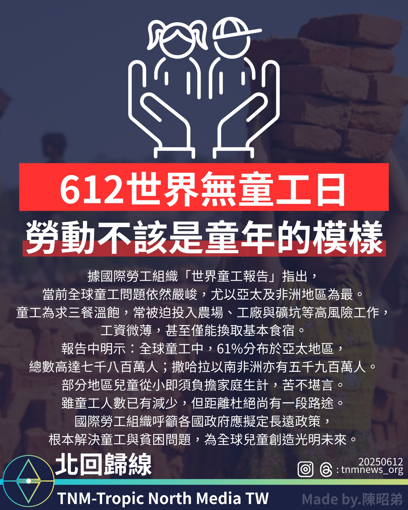

# 全球童工問題依然嚴峻，亞太與非洲地區受影響最深

📅 2025年6月12日  
✍️ 陳招弟｜專題報導

---

國際勞工組織最新報告指出全球童工仍廣泛存在，特別在亞太與非洲地區，呼籲各國採取長遠政策杜絕童工現象。

---

## 數據揭示：童工仍高達一億四千萬人

根據國際勞工組織（ILO）最新發布的《世界童工報告》，全球童工問題依然嚴峻，尤其在亞太及撒哈拉以南非洲地區情況最為突出。

報告指出，全球童工數量雖已有所下降，但仍高達 **一億四千兩百萬人**，其中：

- **61% 分布於亞太地區**，約七千八百萬童工  
- **撒哈拉以南非洲**則約有五千九百萬童工

這些兒童常被迫從事農場、工廠及礦坑等高風險工作，工資微薄甚至僅能換取基本食宿條件。

---

## 童年被剝奪：生活困苦與教育缺失

許多童工為了家庭生計，從小就承擔沉重負擔，生活困苦，無法享有應有的童年與教育權利。

---

## ILO呼籲：制定長期政策，終結童工現象

國際勞工組織呼籲各國政府：

- 制定並執行長期政策  
- 結合消除貧困、教育普及及勞動保障  
- 徹底解決童工問題，為全球兒童創造更光明的未來

