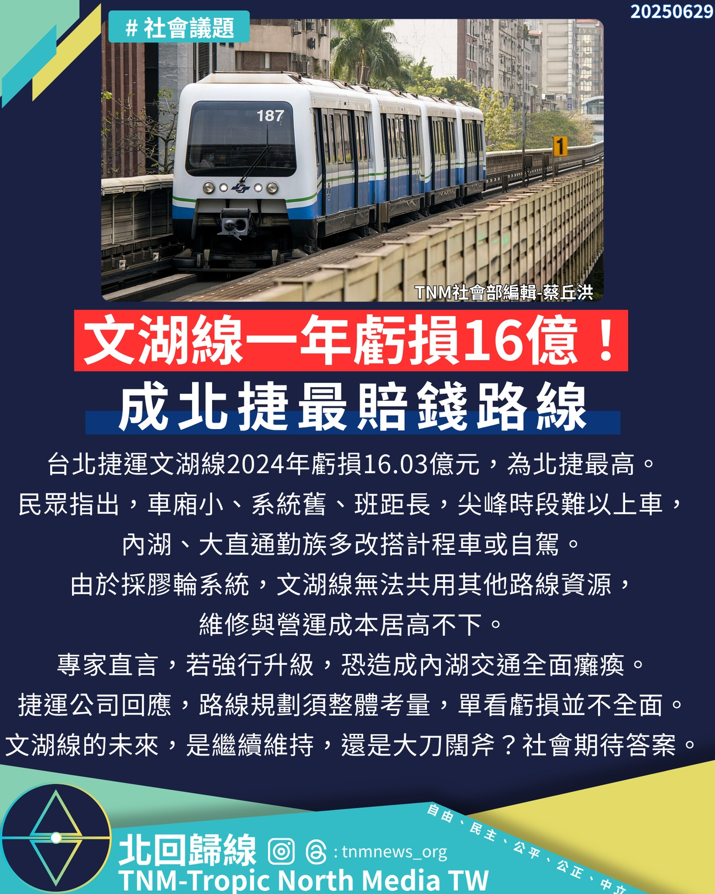

# 文湖線虧損慘重 市民質疑捷運未來發展

📅 2025年6月29日  
✍️ 蔡丘洪｜交通議題

---

台北捷運作為雙北地區重要大眾運輸系統，每日平均載客超過190萬人次，是市民日常通勤的重要命脈。

然近來有網友揭露，文湖線不僅擁擠不堪、車廂不足，更因設備老舊與系統過時，成為整體系統中虧損最高的路線。

---

## 數據揭露：文湖線虧損達16.03億元

根據北捷2024年統計，文湖線虧損達 **16.03億元**，遠高於其他路線，引發外界對其未來營運的質疑與憂慮。

不少市民反映，尖峰時段雖有縮短列車班距，但實際候車時間仍需等待兩班以上列車才能搭乘。

> 「這條捷運，看不到未來。」  
> —— 網友留言

車廂共振聲響大，乘坐舒適度大打折扣。

---

## 系統瓶頸：膠輪技術與月台限制

文湖線使用全台唯一的膠輪系統，無法與其他路線共用維修設施及零件，導致營運成本居高不下。

且因原設計僅有兩節車廂，月台預留空間有限，改建困難重重。

專家指出，若要升級為高運量系統，可能需停駛數月，將嚴重影響內湖地區交通。

---

## 北捷回應與未來展望

北捷回應表示，捷運路網規劃需從整體系統角度考量，單以盈虧數據評價個別路線恐有失公允。

文湖線的未來是否停擺、改建或持續營運，仍待相關單位審慎評估。

---

📣 **您怎麼看文湖線的未來？歡迎在留言區分享您的意見。**

