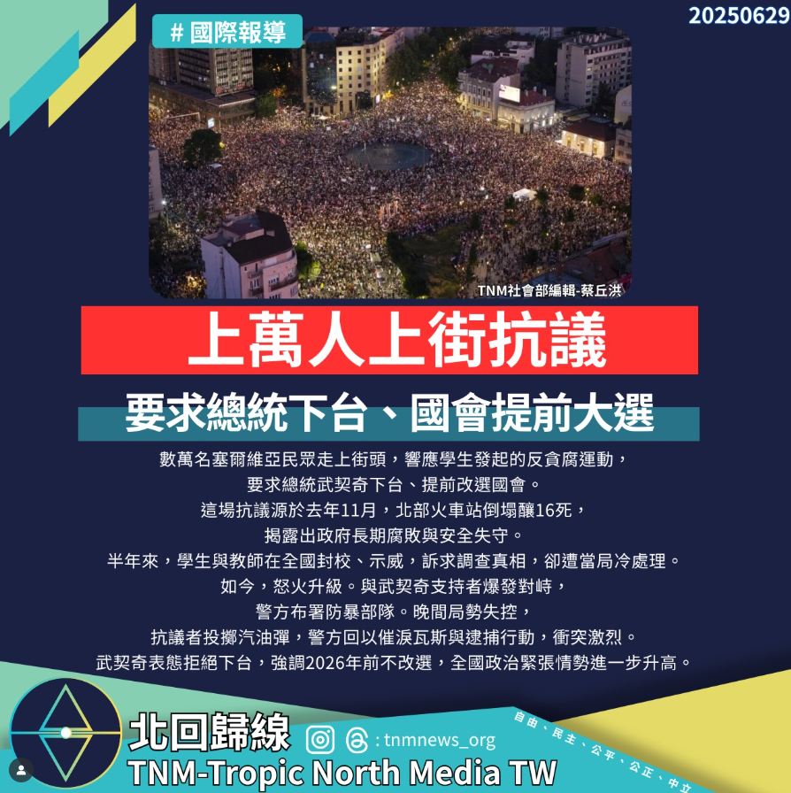

# 萬人上街抗議，要求總統下台、國會提前大選

📅 2025年6月29日  
✍️ 蔡丘洪｜北回歸線社會部

---

數萬名塞爾維亞民眾走上街頭，響應學生發起的反貪腐運動，要求總統武契奇下台、提前改選國會。

---

## 起因：火車站倒塌釀16死

這場抗議源於 2024 年 11 月，北部城市諾維薩德火車站倒塌釀成 16 人死亡，揭露出政府長期腐敗與公共安全失守。

半年來，學生與教師在全國封校、示威，訴求調查真相，卻遭當局冷處理。

---

## 衝突升級：催淚瓦斯與逮捕行動

如今怒火升級，抗議者與武契奇支持者爆發對峙，警方布署防暴部隊。晚間局勢失控，抗議者投擲汽油彈，警方回以催淚瓦斯並展開逮捕行動，衝突激烈。

---

## 武契奇拒絕下台　政治緊張加劇

總統武契奇表態拒絕下台，強調 **2026 年前不改選**，全國政治緊張情勢進一步升高。

> 「我們在這裡鼓起勇氣，也竭盡全力，支持學生們所代表的一切。」  
> —— 塞爾維亞抗議民眾

