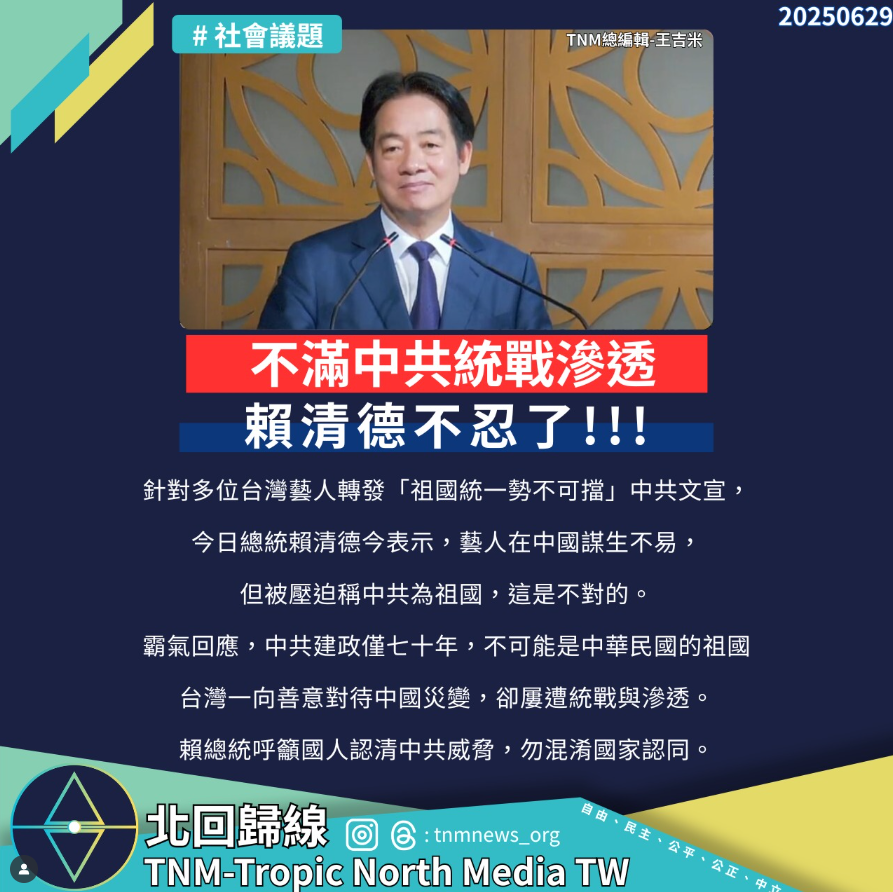

# 賴總統批藝人轉發統一文：中共不是我們的祖國

📅 2025年6月29日  
✍️ 北回歸線總編輯 王吉米｜時事評論

---

針對多位台灣藝人轉發「祖國統一勢不可擋」中共文宣，總統賴清德今表示，藝人在中國謀生不易，但被壓迫稱中共為祖國，這是不對的。

---

## 中共不是我們的祖國

賴總統指出，中共建政僅七十年，不可能是中華民國的祖國。  
台灣一向善意對待中國災變，卻屢遭統戰與滲透。

他呼籲國人認清中共威脅，勿混淆國家認同。

---

## 社會反應與輿論焦點

此番言論出現在多位台灣藝人轉發央視統一文宣後，包括五月天、蔡依林、楊丞琳等人皆在微博表態，引發台灣社會廣泛討論。

賴清德表示理解藝人身處中國的壓力，但也強調不能因生存壓力而模糊台灣的主權立場。

---

## 國台辦反批與兩岸輿論升溫

國台辦則反批賴清德為「中華民族罪人」，指台灣藝人表達中國認同是「真情流露」，兩岸輿論持續升溫。

---

> 台灣的民主與自由，不能被市場壓力吞噬。  
> —— TNMNEWS 編輯部

