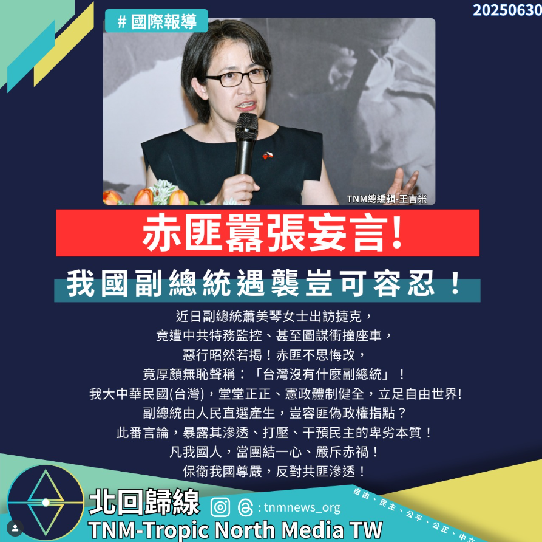

# 【中共滲透境外，副總統遇襲！台灣不是你說了算】

📅 2025年6月30日  
✍️ TNM總編輯 王吉米｜時事評論

---

一樁令人髮指的暴行，再次揭露共匪政權蠻橫無理、橫行無忌的真面目！

我國副總統蕭美琴女士，近期正式出訪捷克，遭中共情治單位全程監控，甚至傳出計畫衝撞其座車！  
捷克軍事情報局已證實此一惡行，震驚歐洲政壇。

---

## 北京冷血回應：否認副總統身分

就在事件曝光後，北京外交部發言人毛寧竟冷血回應：

> 「台灣沒什麼副總統。」

並妄稱中共「遵守駐在國法律」──敢問這就是中共的守法？

---

## 極權嘴臉再現：干預他國、踐踏民主

赤匪不但不認錯，還倒打一耙，指責友邦「允許台獨分子竄訪」，  
處處干預他國內政，肆意踐踏民主原則，完全暴露其極權帝國主義的嘴臉！

---

## 台灣的正統與尊嚴

中華民國是主權國家，副總統是由 2300 萬人民依法選出，中共無權置喙。

蕭美琴女士代表的是人民的選票，是國家的正統，絕不是什麼「頑固分子」。

你們中共怕的，不是某個人，而是民主自由的光照到你們那座黑暗的城牆。

---

> 歷史早已證明，威權擋不住自由，打壓無法消滅意志。  
> 我們的答案，從來不是屈服，而是更加團結。
