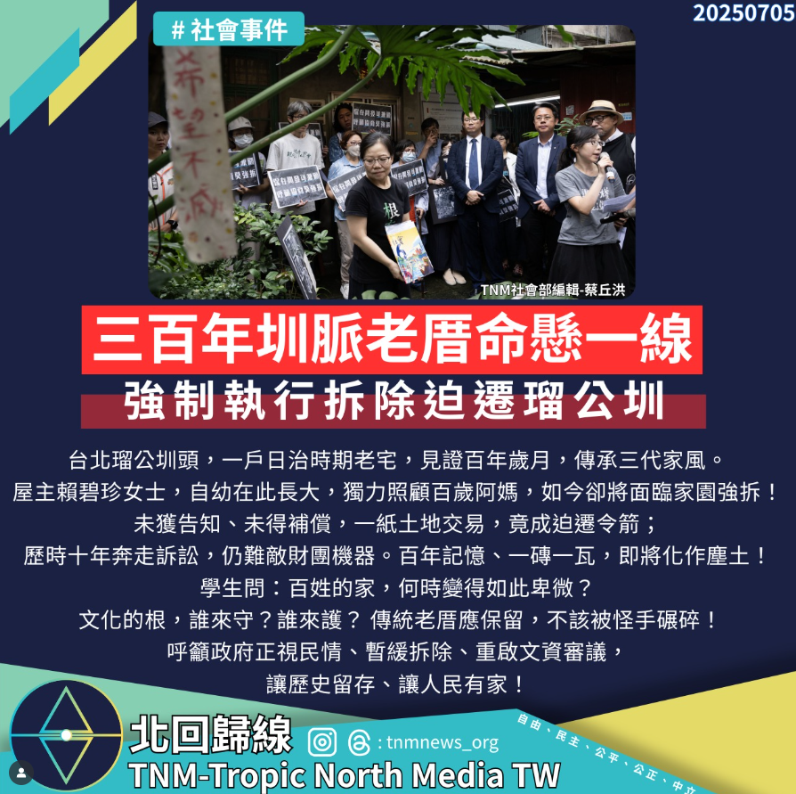

# 【三百年圳脈老厝命懸一線，百姓血淚呼天不應！】

📅 2025年7月5日  
✍️ 北回歸線社會部編輯 蔡丘洪｜社會觀察

---

台北瑠公圳頭，一戶日治時期老宅，見證百年歲月，傳承三代家風。  
屋主賴碧珍女士，自幼在此長大，獨力照顧百歲阿媽，如今卻將面臨家園強拆！

未獲告知、未得補償，一紙土地交易，竟成迫遷令箭；  
歷時十年奔走訴訟，仍難敵財團機器。百年記憶、一磚一瓦，即將化作塵土！

---

## 學生問：百姓的家，何時變得如此卑微？

文化的根，誰來守？誰來護？  
傳統老厝應保留，不該被怪手碾碎！

---

## 呼籲政府：暫緩拆除，重啟文資審議

讓歷史留存、讓人民有家！

---

### 📢 標籤行動

- #瑠公圳迫遷案  
- #百年老宅非商品  
- #文化資產不是障礙  
- #人民的家不是塊地  
- #捍衛歷史記憶

