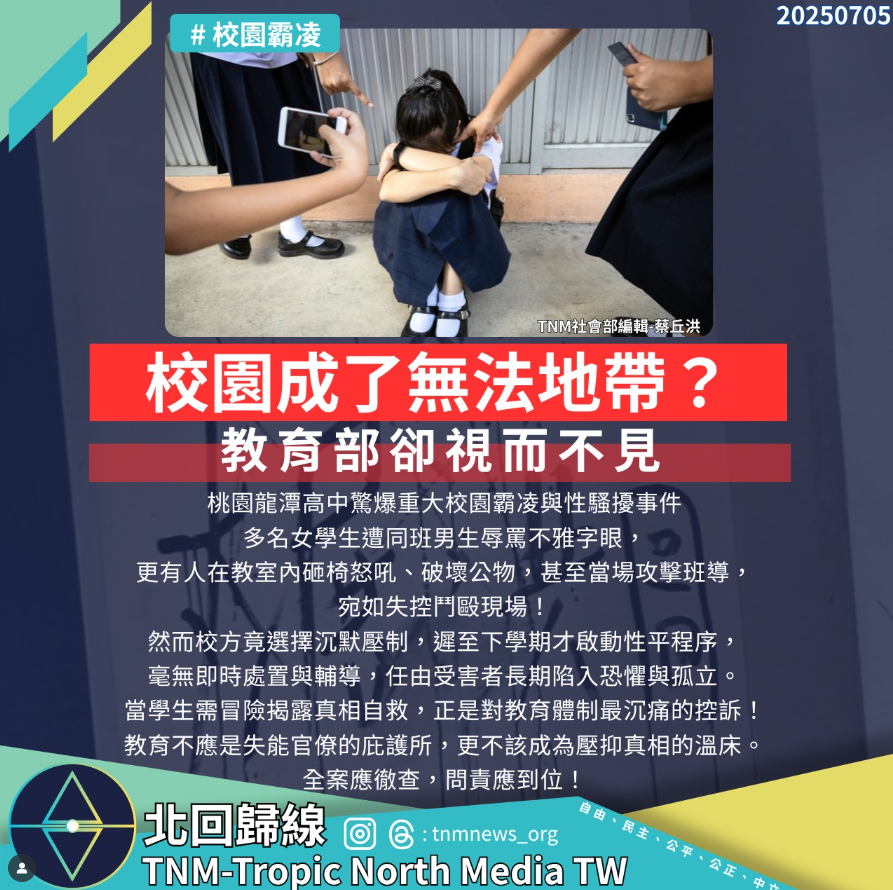

# 【校園成了無法地帶？教育體制已然失守！】

📅 2025年7月5日  
✍️ 北回歸線社會部編輯 蔡丘洪｜校園觀察

---

桃園龍潭高中驚爆重大校園霸凌與性騷擾事件，多名女學生遭同班男生辱罵不雅字眼，甚至有人在教室內砸椅怒吼、破壞公物，當場攻擊班導，宛如失控鬥毆現場！

---

## 校方壓制真相，性平程序延遲

事件發生於 2024 年底，校方卻遲至下學期才啟動性平程序，毫無即時處置與輔導，任由受害者長期陷入恐懼與孤立。

> 「我們中午只能躲進輔導室避難，卻被要求回教室午休。」  
> —— 龍潭高中女學生在 Threads 上控訴

---

## 教育體制失守，學生自救成控訴

當學生需冒險揭露真相自救，正是對教育體制最沉痛的控訴！

教育不應是失能官僚的庇護所，更不該成為壓抑真相的溫床。

---

## 社會呼籲：徹查問責，還學生公道

桃園市教育局已證實事件屬實，並要求校方依《校園霸凌防制準則》與《性別平等教育法》辦理後續調查與輔導。

全案應徹查，問責應到位！

