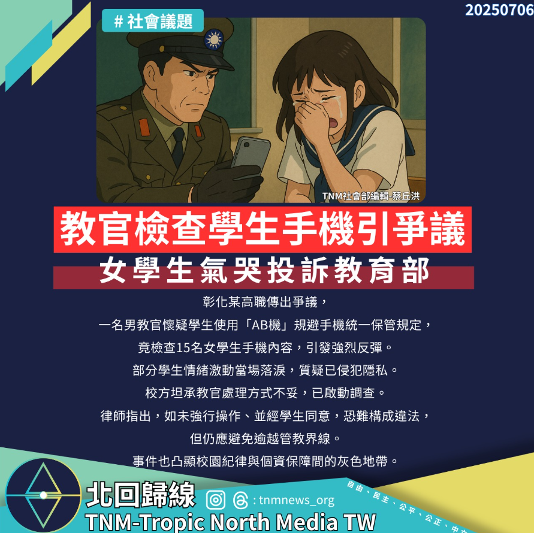

# 【教官檢查學生手機引爭議，女學生氣哭投訴教育部】

📅 2025年7月6日  
✍️ TNM社會部編輯 蔡丘洪｜校園紀律觀察

---

彰化某高職傳出爭議，一名男教官懷疑學生使用「AB機」規避手機統一保管規定，竟檢查 15 名女學生手機內容，引發強烈反彈。

部分學生情緒激動當場落淚，質疑已侵犯隱私。

---

## 校方啟動調查　律師提醒界線

校方坦承教官處理方式不妥，已啟動調查。

律師指出，如未強行操作、並經學生同意，恐難構成違法，但仍應避免逾越管教界線。

---

## 灰色地帶：紀律 vs 個資保障

事件也凸顯校園紀律與個資保障間的灰色地帶。

> 手機管理不該成為侵犯隱私的藉口，  
> 教育現場需要更清晰的規範與尊重。

