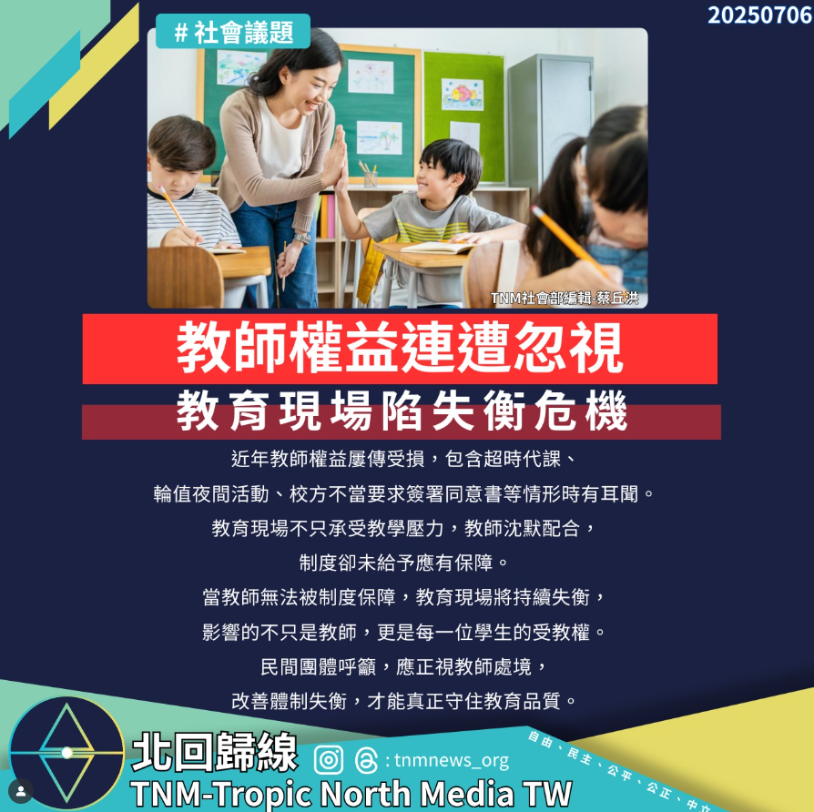

# 【教師權益連遭忽視　教育現場陷失衡危機】

📅 2025年7月6日  
✍️ TNM社會部編輯 蔡丘洪｜教育觀察

---

近年教師權益屢傳受損，包含：

- 超時代課  
- 輪值夜間活動  
- 校方不當要求簽署同意書  

等情形時有耳聞。

教育現場不只承受教學壓力，教師沈默配合，制度卻未給予應有保障。

---

## 教師無保障，受教權受影響

當教師無法被制度保障，教育現場將持續失衡，影響的不只是教師，更是每一位學生的受教權。

---

## 民間呼籲：改善體制，守住品質

民間團體呼籲，應正視教師處境，改善體制失衡，才能真正守住教育品質。

