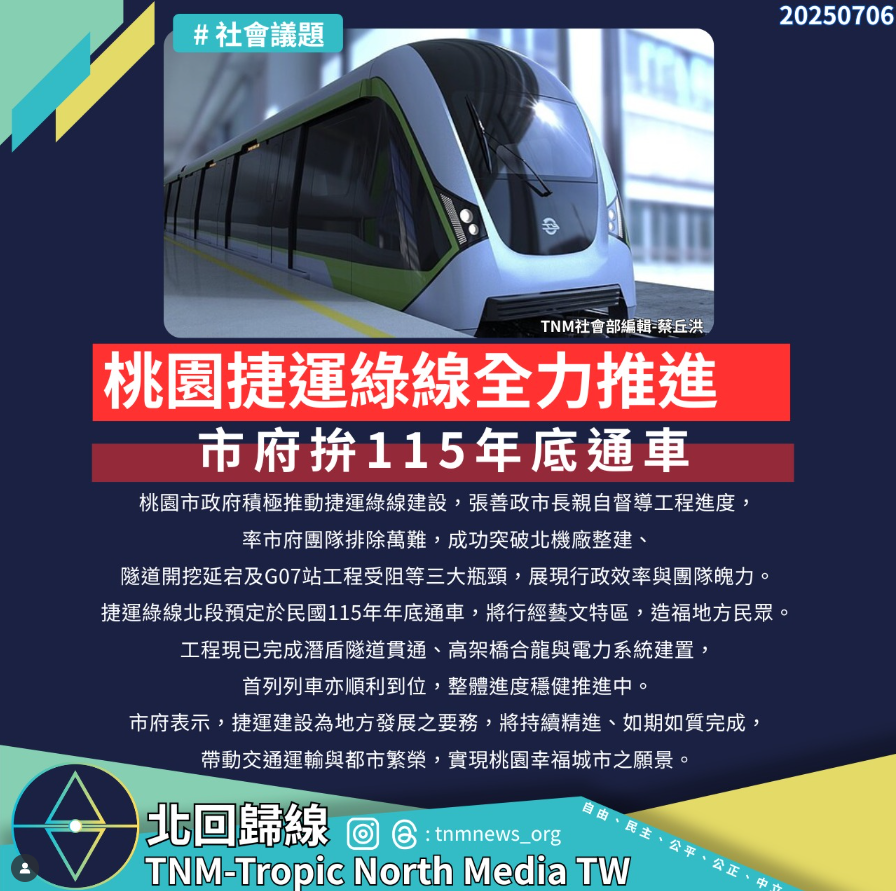

# 桃園捷運綠線全力推進　市府克服萬難拚115年底通車

📅 2025年7月6日  
✍️ TNM社會部編輯 蔡丘洪｜交通建設

---

桃園市政府積極推動捷運綠線建設，張善政市長親自督導工程進度，率市府團隊排除萬難，成功突破：

- 北機廠整建  
- 隧道開挖延宕  
- G07站工程受阻  

展現行政效率與團隊魄力。

---

## 工程進度穩健　年底通車目標明確

捷運綠線北段預定於 **民國115年年底通車**，將行經藝文特區，造福地方民眾。

目前已完成：

- 潛盾隧道貫通  
- 高架橋合龍  
- 電力系統建置  
- 首列列車到位

整體進度穩健推進中。

---

## 市府願景：交通繁榮、幸福城市

市府表示，捷運建設為地方發展之要務，將持續精進、如期如質完成，  
帶動交通運輸與都市繁榮，實現桃園幸福城市之願景。

