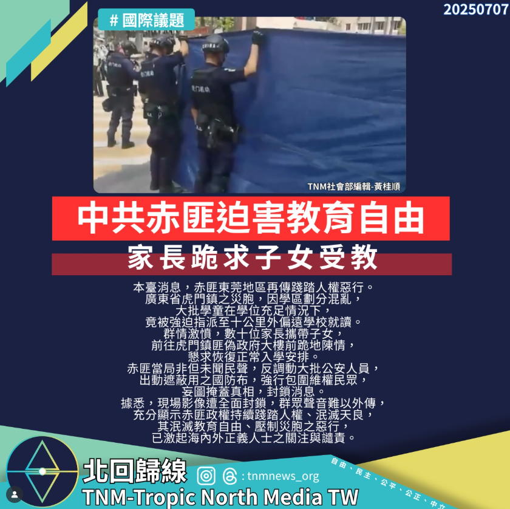

# 【中共赤匪迫害教育自由　家長跪求子女受教】

📅 2025年7月7日  
✍️ TNM社會部編輯 黃桂順｜人權觀察

---

本臺消息，赤匪東莞地區再傳踐踏人權惡行。

廣東省虎門鎮之災胞，因學區劃分混亂，  
大批學童在學位充足情況下，竟被強迫指派至十公里外偏遠學校就讀。

---

## 家長跪地陳情　公安強勢封鎖

群情激憤，數十位家長攜帶子女，前往虎門鎮匪偽政府大樓前跪地陳情，懇求恢復正常入學安排。

赤匪當局非但未聞民聲，反調動大批公安人員，出動遮蔽用之國防布，強行包圍維權民眾，妄圖掩蓋真相、封鎖消息。

---

## 教育自由遭踐踏　國際關注升溫

據悉，現場影像遭全面封鎖，群眾聲音難以外傳，充分顯示赤匪政權持續踐踏人權、泯滅天良。

其泯滅教育自由、壓制災胞之惡行，已激起海內外正義人士之關注與譴責。

