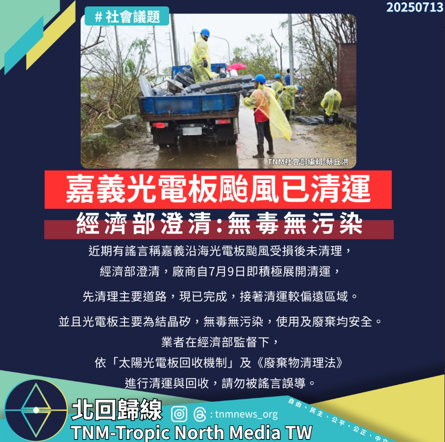

# 【經濟部澄清：嘉義光電板颱風後已展開清運，無毒無污染】

📅 2025年7月13日  
✍️ TNM社會部編輯 蔡丘洪｜環境與能源觀察

---

針對近日網傳「嘉義沿海光電板遭颱風摧毀後未清理」的說法，經濟部 7 日發出聲明澄清，強調相關訊息為不實傳言。

事實上，業者自災後即展開清運，主要通行路段已於今日完成清理，後續也將持續處理滯洪池區內光電板殘件。

---

## 災後應變：清運作業已啟動

受影響的是設置於嘉義部分滯洪池的太陽光電設施，  
因中度颱風「丹娜絲」於當地沿海帶來罕見 13 級強陣風，造成部分設備受損。

事發後，相關廠商已於 7 月 9 日動員人力投入清運作業，  
優先處理主要道路與民眾生活周邊，目前主幹道區域已全面完成清理。

---

## 光電板無毒　請勿輕信錯誤訊息

針對網路上流傳的「有毒」、「造成污染」說法，經濟部特別指出：

- 光電板主要為結晶矽材質  
- 無毒無害，不論使用或廢棄狀態下皆不會造成環境污染風險

---

## 回收機制合法執行中

後續清理與回收作業將由廠商依《廢棄物清理法》及環境部制定的「太陽光電板回收機制」辦理，  
並在經濟部督導下全程執行，確保處理過程合法、安全且無虞。

