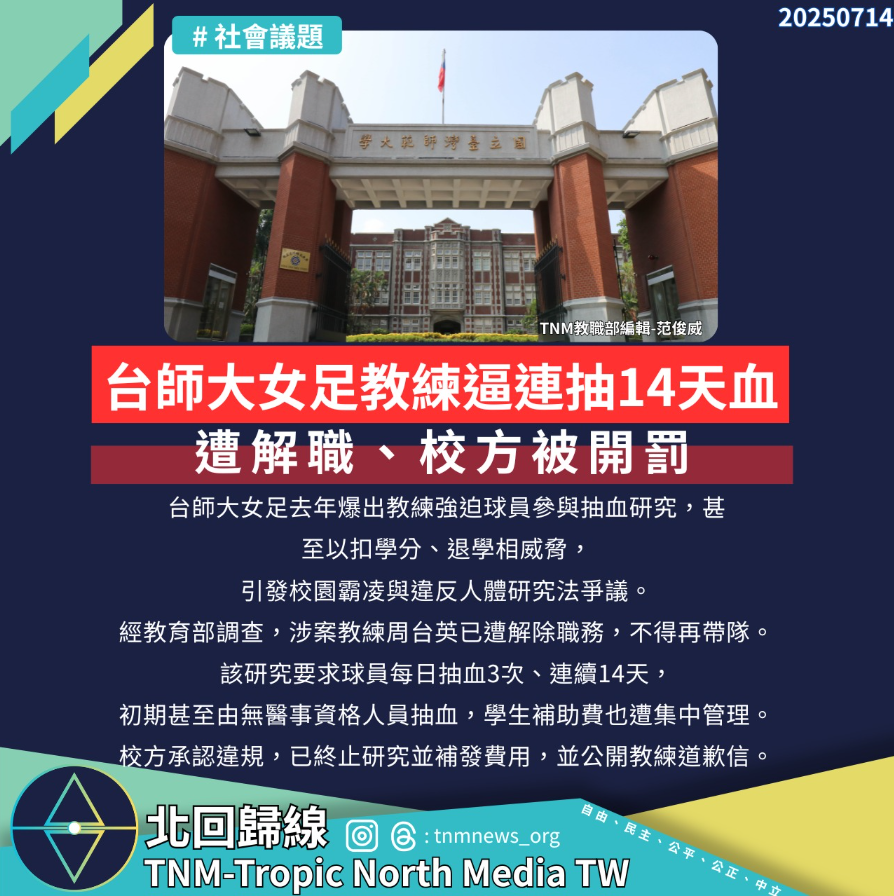

# 【台師大女足教練逼連抽14天血　遭解職、校方被開罰】

📅 2025年7月14日  
✍️ TNM教職部編輯 范俊威｜校園倫理觀察

---

台師大女足去年爆出教練強迫球員參與抽血研究，甚至以扣學分、退學相威脅，引發校園霸凌與違反《人體研究法》爭議。

---

## 研究內容爭議　學生身心受創

該研究要求球員每日抽血 3 次、連續 14 天，初期甚至由無醫事資格人員抽血。  
學生補助費也遭集中管理，引發多方質疑。

---

## 教練遭解職　校方承認違規

教育部調查後，涉案教練周台英已遭解除職務，不得再帶隊。  
校方承認違規，已終止研究並補發費用，並公開教練道歉信。

---

## 教育部裁罰　啟動教評會審議

教育部認定校方失職，依《人體研究法》裁罰：

- 自 7 月起停權人體研究新案審查 3 個月  
- 限期改善研究制度  
- 霸凌部分已啟動教評會審議  
- 教育部將持續監督後續處理

---

📞 教育部反霸凌專線：**1953**

