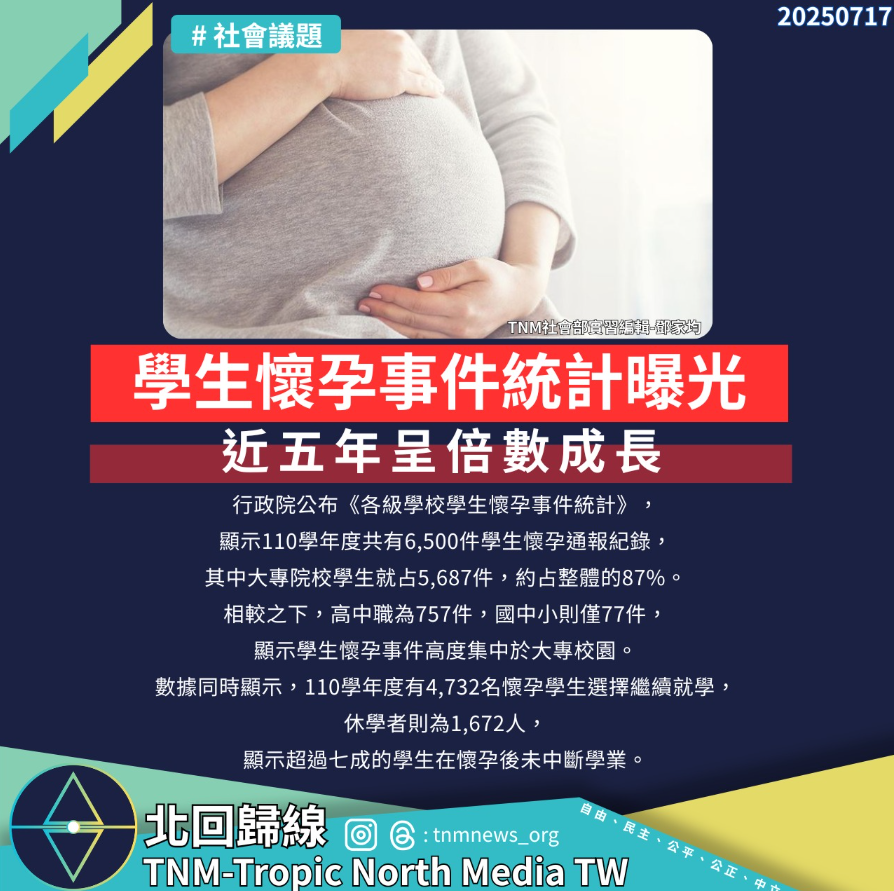

# 【學生懷孕通報統計出爐：大專校院占比最高，逾七成選擇繼續學業】

📅 2025年7月13日  
✍️ 社會部實習編輯 鄧家均｜教育與社會觀察

---

行政院公布最新《學生懷孕事件通報統計》，顯示自 107 學年度起，全國學生懷孕通報數大幅增加，  
108 至 110 學年度每年都超過 **6,000 件**。

其中以 **大專校院** 通報件數最多：

- 110 學年度：5,687 件  
- 高中職：757 件  
- 國中小：77 件

---

## 通報制度調整　數據能見度提升

此變化與通報制度調整有關。108 學年度起，政府納入衛福部「健康保險資料庫」資料，  
擴大納入孕產、流產、輔導等個案，使統計數據比以往更完整。

107 學年度前，數據偏低，如 105 學年度僅 784 件，顯示新制確實提高了案件能見度。

---

## 七成學生選擇繼續學業

除了數量，統計也反映出學生選擇持續就學的趨勢。

以 110 學年度為例，在 6,500 件通報中：

- 未休退學：4,732 人  
- 選擇休學：1,672 人  

代表超過 **七成懷孕學生選擇繼續完成學業**。

---

> 教育制度的支持與彈性，將是學生能否安心完成學業的關鍵。

