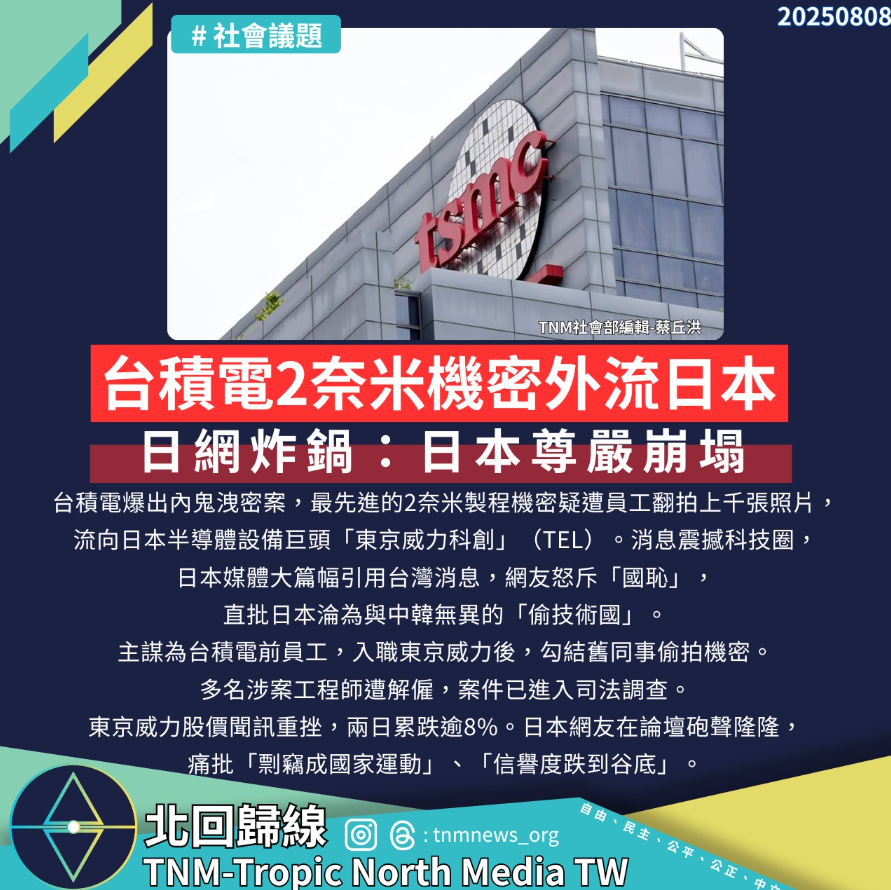

# 台積電2奈米機密驚傳外流，日網炸鍋：日本尊嚴崩塌

📅 2025年8月8日  
✍️ 蔡丘洪｜社會議題

---

台積電爆出內鬼洩密案，最先進的 2 奈米製程機密疑遭員工翻拍上千張照片，流向日本半導體設備巨頭「東京威力科創」（TEL）。

消息震撼科技圈，日本媒體大篇幅引用台灣消息，網友怒斥「國恥」，直批日本淪為與中韓無異的「偷技術國」。

---

## 洩密案細節與司法調查

主謀為台積電前員工，入職東京威力後，勾結舊同事偷拍機密。  
多名涉案工程師遭解僱，案件已進入司法調查。

東京威力股價聞訊重挫，兩日累跌逾 8%。

---

## 日本輿論反應：信任危機爆發

日本網友在論壇 5ch 砲聲隆隆，痛批：

> 「剽竊成國家運動」、「信譽度跌到谷底」

有人憂心，這將重創日本半導體設備業的國際信任與競爭力。

