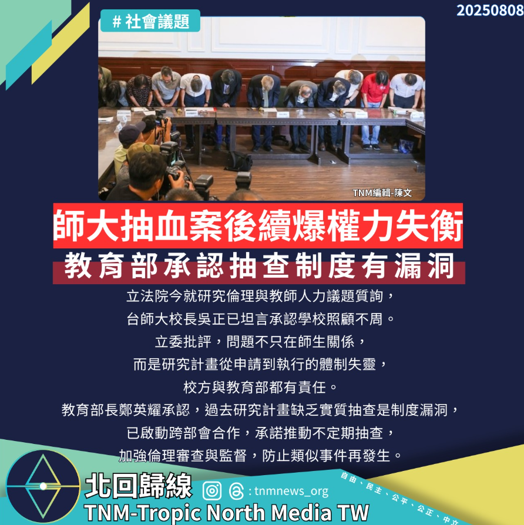

# 【師大抽血案後續爆權力失衡，教育部承認抽查制度有漏洞】

📅 2025年8月8日  
✍️ 陳文｜TNM教職部

---

立法院今就研究倫理與教師人力議題質詢，  
台師大校長吳正已坦言承認學校照顧不周。

---

## 問題不只在師生關係，是整體制度失靈

立委批評，問題不只在師生關係，  
而是研究計畫從申請到執行的體制失靈，校方與教育部都有責任。

---

## 教育部承認漏洞　承諾改革抽查制度

教育部長鄭英耀承認，過去研究計畫缺乏實質抽查是制度漏洞，  
已啟動跨部會合作，承諾推動：

- 不定期抽查  
- 加強倫理審查與監督  
- 防止類似事件再發生

---

> 研究倫理不只是表面審查，更需要制度性監督與權力平衡。
