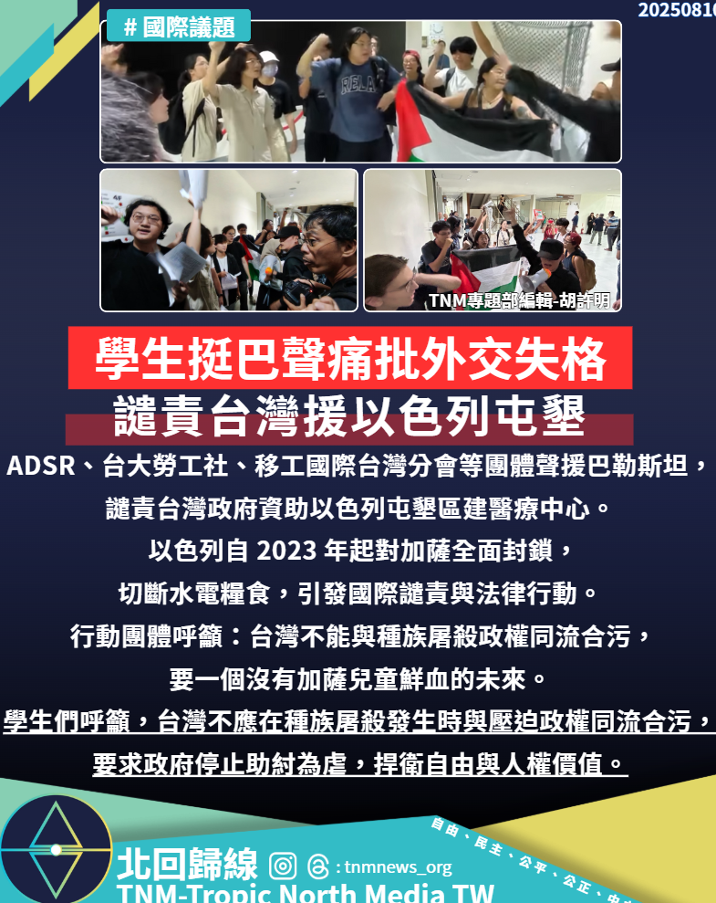

# 【學生挺巴聲痛批外交失格，譴責台灣援以色列屯墾】

📅 2025年8月10日  
✍️ 胡許明｜TNM國際觀察

---

ADSR、台大勞工社、移工國際台灣分會等團體聲援巴勒斯坦，  
譴責台灣政府資助以色列屯墾區建醫療中心。

---

## 國際背景：加薩封鎖與人道危機

以色列自 2023 年起對加薩全面封鎖，切斷水電糧食，  
引發國際譴責與法律行動。

行動團體指出，台灣不應在此時與加害政權合作，  
更不應資助屯墾區建設，間接強化壓迫結構。

---

## 學生與團體訴求

- 台灣不能與種族屠殺政權同流合污  
- 要一個沒有加薩兒童鮮血的未來  
- 要求政府停止助紂為虐，捍衛自由與人權價值

---

> 「外交不是冷血交易，而是價值選擇。」  
