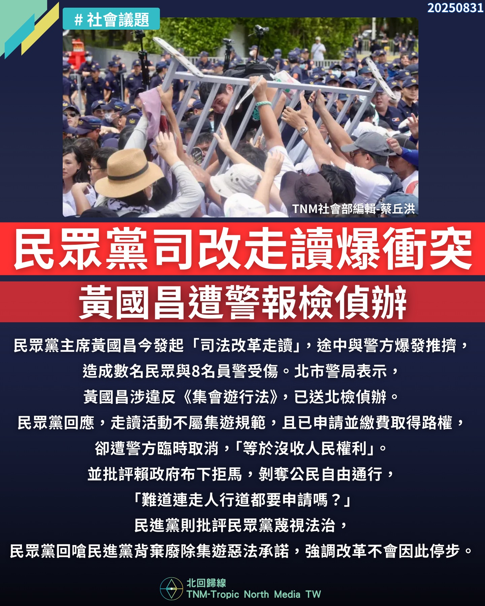

# 【民眾黨司改走讀爆衝突　黃國昌遭警報檢偵辦】

📅 2025年8月31日  
✍️ 蔡丘洪｜TNM政治與公民權觀察

---

台北市警局今天表示，民眾黨主席黃國昌號召「司法改革走讀」，  
過程中群眾與警方多次推擠，甚至有民眾拍攝到警方將人拖至樹後用束帶綁起來，  
造成數名民眾與 8 名員警受傷。

---

## 警方指控：違反集遊法、破壞拒馬

警方指控黃國昌：

- 涉違反《集會遊行法》  
- 推擠員警、破壞拒馬  
- 將報請台北地檢署偵辦

---

## 民眾黨反駁：走讀非集會，路權遭取消

民眾黨回應：

- 活動屬「走讀」，非集會遊行，不受《集遊法》規範  
- 現場非集會禁制區，卻遭警方以拒馬攔阻  
- 原已申請並繳費完成路權，卻遭警方單方面取消  
- 痛批「難道人民連走人行道都要先申請？」
