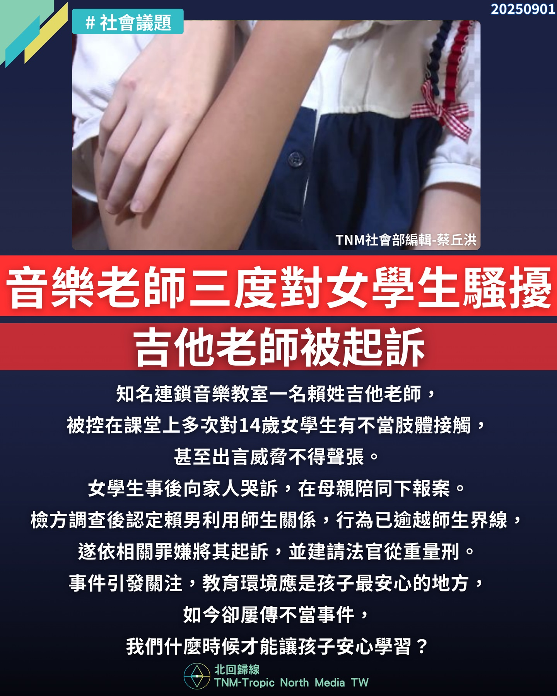

# 【知名音樂老師三度對女學生騷擾　吉他老師被起訴】

📅 2025年9月1日  
✍️ 蔡丘洪｜TNM教育與司法觀察

---

知名連鎖音樂教室一名賴姓吉他老師，  
被控在課堂上多次對 14 歲女學生有不當肢體接觸，  
甚至出言威脅不得聲張。

女學生事後向家人哭訴，在母親陪同下報案。

---

## 檢方認定：逾越師生界線，依法起訴

檢方調查後認定：

- 賴男利用師生關係  
- 行為已逾越師生界線  

