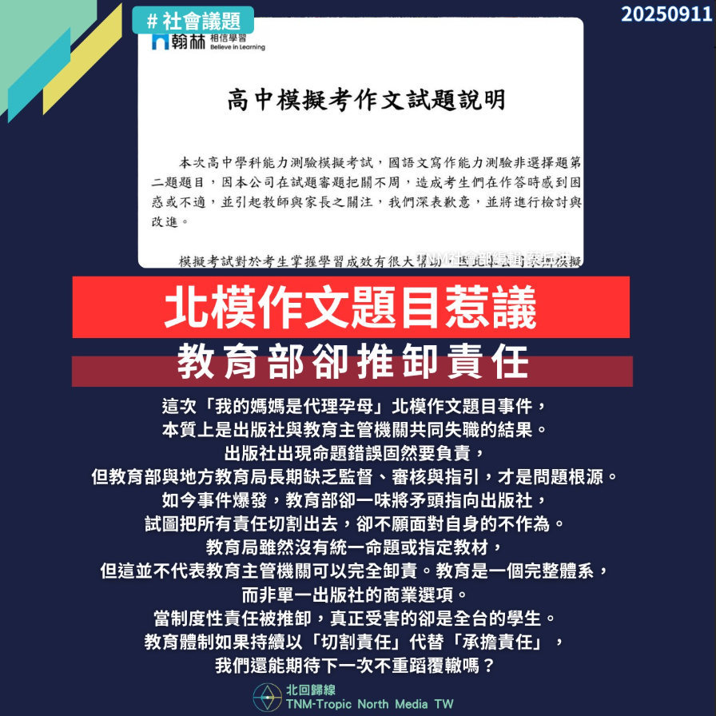

# 【教育部推卸責任，誰為錯誤買單？】

📅 2025年9月11日  
✍️ 蔡丘洪｜TNM教育制度觀察

---

這次「我的媽媽是代理孕母」北模作文題目事件，  
本質上是出版社與教育主管機關共同失職的結果。

---

## 出版社命題錯誤，教育部卻切割責任

出版社出現命題錯誤固然要負責，  
但教育部與地方教育局長期缺乏監督、審核與指引，才是問題根源。

如今事件爆發，教育部卻一味將矛頭指向出版社，  
試圖把所有責任切割出去，卻不願面對自身的不作為。

---

## 教育體系不是商業選項，而是公共責任

教育局雖然沒有統一命題或指定教材，  
但這並不代表教育主管機關可以完全卸責。

教育是一個完整體系，而非單一出版社的商業選項。

---

## 真正受害者是學生

當制度性責任被推卸，真正受害的卻是全台的學生。

教育體制如果持續以「切割責任」代替「承擔責任」，  
我們還能期待下一次不重蹈覆轍嗎？

---

> 「教育不是推責遊戲，而是對每個孩子的承諾。」  
> —— TNM評論部

