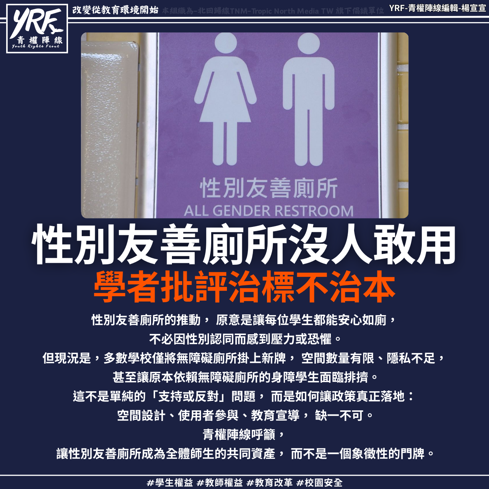

# 【學生團體集會　反對台灣捲入種族滅絕爭議】

📅 2025年9月25日  
✍️ 楊宣宣｜TNM國際與學權觀察

---

台北南港展覽館舉行「台灣國際航太暨國防工業展」，  
吸引超過 450 家國內外軍火與航太廠商參展。

9 月 22 日，巴勒斯坦自由連線與學生團體「捍衛全台學權行動」  
在場外舉行「反對台灣捲入種族滅絕集會」，並發佈調查報告。

---

## 指控：企業與以色列軍方合作，引發人權疑慮

調查報告指出：

- 多家參展企業與以色列軍方合作  
- 產品疑涉加薩地區軍事行動  
- 引發人權與戰爭責任疑慮

---

## 外交部立場與現場衝突

抗議者批評：

- 外交部不承認巴勒斯坦國，卻選擇與以色列站隊  
- 忽視人權價值，背離台灣民主承諾

現場並發生：

- 外籍學生僅拍攝抗議畫面卻遭警方依《社維法》帶回  
- 一度面臨遣返威脅，引發對學權與言論自由的關注

---

## 社會質疑：台灣是否忽略人權與公義？

此事持續引發社會討論：

- 台灣在追求國際承認的同時  
- 是否忽略了人權與公義的基本原則？

---

> 「我們不是反對國防展，而是反對種族
