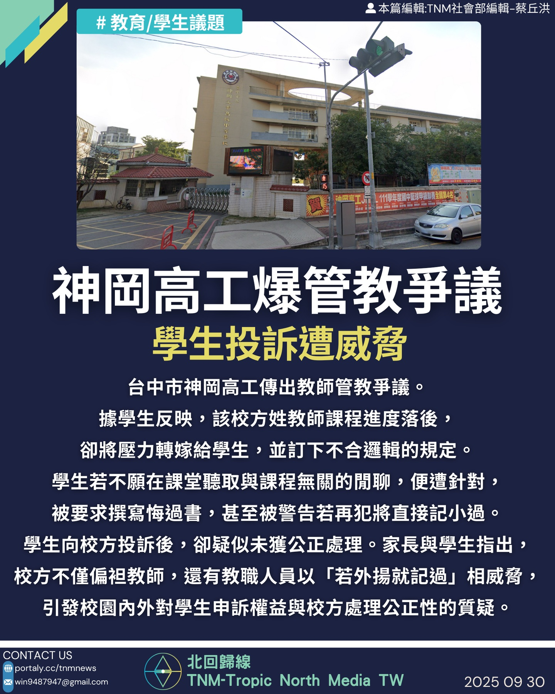
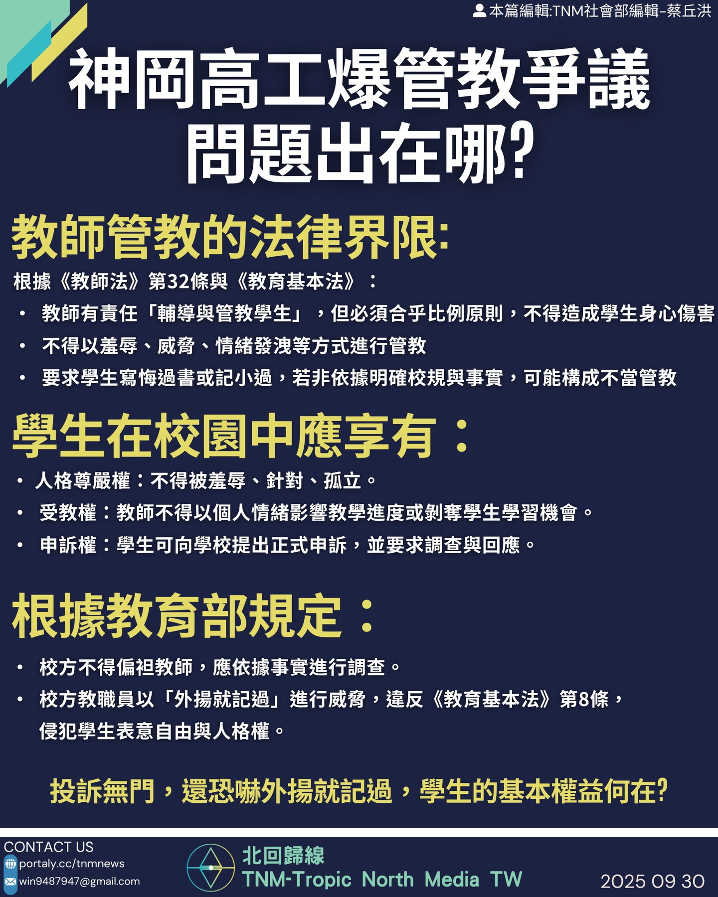
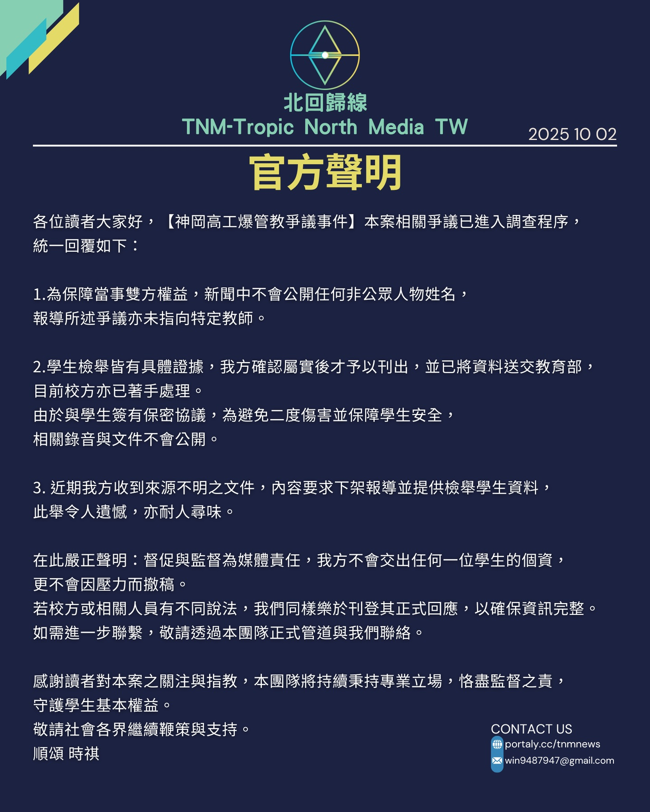

# 【神岡高工爆管教爭議，學生投訴遭威脅】

📅 2025年9月30日  
✍️ 蔡丘洪｜TNM教育現場觀察

---

台中市神岡高工傳出教師管教爭議。  
據學生反映，該校方姓教師課程進度落後，  
卻將壓力轉嫁給學生，並訂下不合邏輯的規定。

---

## 學生控訴：不聽閒聊就記過？

- 學生若不願在課堂聽取與課程無關的閒聊，便遭針對  
- 被要求撰寫悔過書，甚至被警告若再犯將直接記小過  
- 學生向校方投訴後，疑似未獲公正處理

---

## 校方疑偏袒教師，學生遭威脅噤聲

家長與學生指出：

- 校方不僅偏袒教師  
- 教職人員甚至以「若外揚就記過」相威脅  
- 引發校園內外對學生申訴權益與校方處理公正性的質疑

---

## 學生應享有的基本權益

- **人格尊嚴權**：不得被羞辱、針對、孤立  
- **受教權**：教師不得以個人情緒影響教學進度或剝奪學習機會  
- **申訴權**：學生可向學校提出正式申訴，並要求調查與回應

---

## 教育部規定：不得以言論威脅學生

根據《教育基本法》第8條：

- 校方不得偏袒教師，應依據事實進行調查  
- 教職員以「外揚就記過」進行威脅，已侵犯學生表意自由與人格權

---

> 投訴無門，還恐嚇外揚就記過，學生的基本權益何在？

