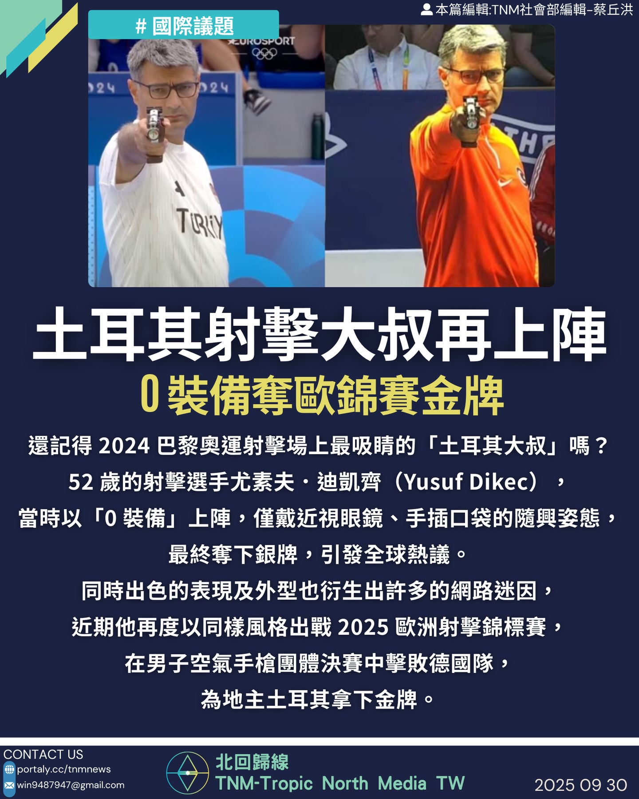

# 【土耳其射擊大叔再度爆紅　0 裝備奪歐錦賽金牌】

📅 2025年10月6日  
✍️ 蔡丘洪｜TNM體育人物觀察

---

還記得 2024 巴黎奧運射擊場上最吸睛的「土耳其大叔」嗎？  
52 歲的射擊選手尤素夫．迪凱齊（Yusuf Dikec），  
當時以「0 裝備」上陣，僅戴近視眼鏡、手插口袋的隨興姿態，  
最終奪下銀牌，引發全球熱議，也誕生無數網路迷因。

---

## 再度登場　歐錦賽奪金

近期他再度以同樣風格出戰 2025 歐洲射擊錦標賽，  
在男子空氣手槍團體決賽中擊敗德國隊，  
為地主土耳其拿下金牌。

---

## 賽後感言：家鄉奪金是極大榮譽

迪凱齊賽後表示：

- 能在家鄉奪金是極大榮譽  
- 將以此作為備戰世界錦標賽的最佳準備

---

> 「我不需要高科技，只需要專注與信念。」  
> —— 尤素夫．迪凱齊

