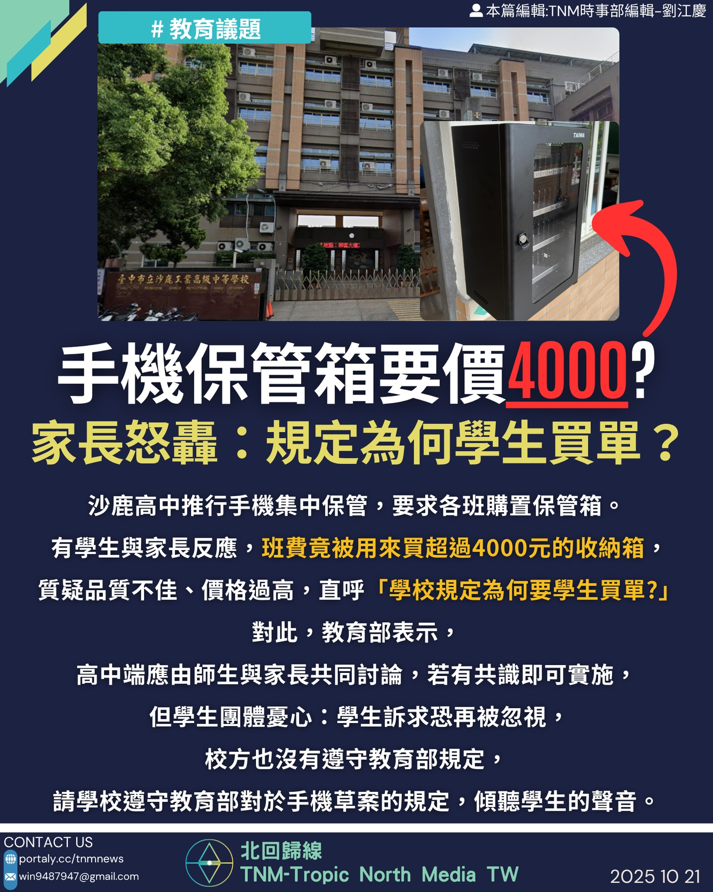

# 【手機保管箱要價4000？家長怒轟：規定為何學生買單？】

📅 2025年10月21日  
✍️ 劉江慶｜TNM教育政策觀察

---

沙鹿高工推行手機集中保管，要求各班購置保管箱。  
有學生與家長反應，班費竟被用來買超過 4000 元的收納箱，  
質疑品質不佳、價格過高，直呼：「學校規定為何要學生買單？」

---

## ⚠️ 已確認為假訊息

!!! 已和學校確認為假訊息 !!!

---

## 教育部回應：應由師生與家長共同討論

教育部表示：

- 高中端應由師生與家長共同討論  
- 若有共識即可實施手機集中保管措施

---

## 學生團體憂心：訴求恐再被忽視

學生團體指出：

- 校方未遵守教育部對手機草案的規定  
- 學生訴求恐再度被忽視  
- 呼籲學校傾聽學生聲音，落實民主參與

---

> 「不是反對管理，而是反對不透明與不合理。」  

