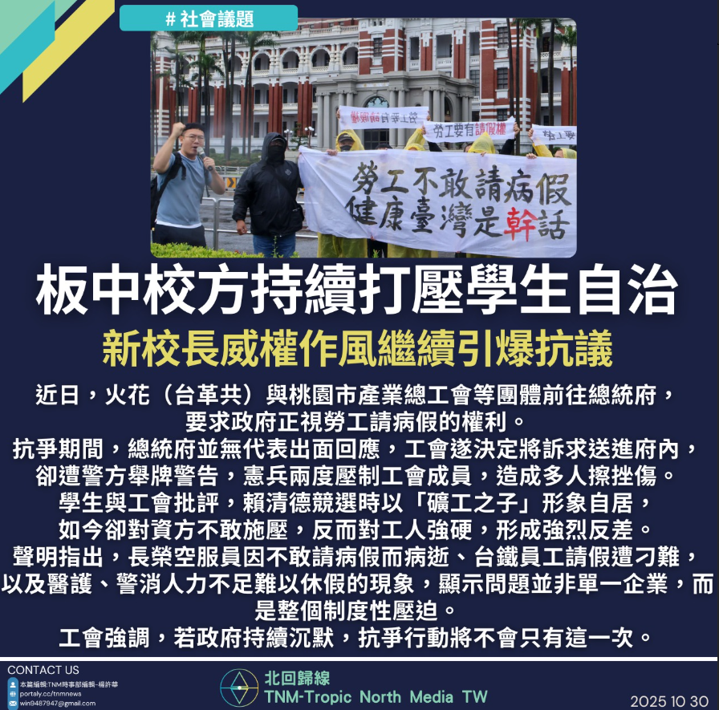

# 【勞工不敢請假，總統不敢表態】

📅 2025年10月30日  
✍️ 楊許華｜TNM勞權與制度觀察

---

火花（台革共）、桃園市產業總工會、台灣鐵路產業工會等團體  
近日前往總統府，要求政府正視勞工請病假的權利。

---

## 抗爭遭壓制　總統府未出面回應

- 總統府並無代表出面回應  
- 工會決定將訴求送進府內  
- 卻遭警方舉牌警告，憲兵兩度壓制工會成員  
- 多人擦挫傷，引發社會關注

---

## 勞工批評：選前礦工之子，選後沉默施壓

學生與工會批評：

- 賴清德競選時以「礦工之子」形象自居  
- 如今卻對資方不敢施壓，反而對工人強硬  
- 形成強烈反差

---

## 制度性壓迫：病假難請、休假困難

聲明指出：

- 長榮空服員因不敢請病假而病逝  
- 台鐵員工請假遭刁難  
- 醫護、警消人力不足，難以休假  
- 問題並非單一企業，而是制度性壓迫

---

## 工會警告：抗爭不會只有這一次

工會強調：

- 若政府持續沉默  
- 抗爭行動將不會只有這一次

---

> 「請假不是特權，是生存的基本權利。」  

