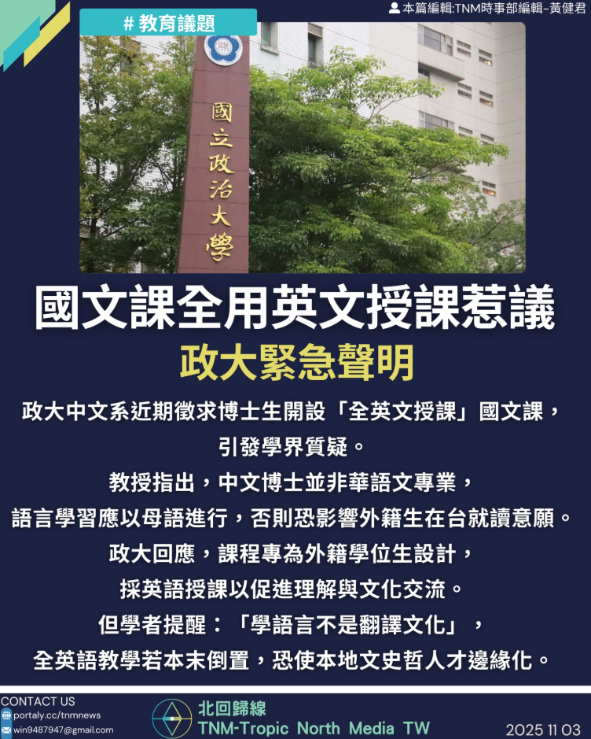

# 【國文課全用英文授課惹議，政大緊急聲明】

📅 2025年11月3日  
✍️ TNM編輯部｜語言教育與文化觀察

---

政大中文系近期徵求博士生開設「全英文授課」國文課，  
引發學界質疑與討論。

---

## 學界質疑：語言學習應以母語進行

- 教授指出，中文博士並非華語文專業  
- 語言學習應以母語進行，否則恐影響外籍生在台就讀意願  
- 學者提醒：「學語言不是翻譯文化」  
- 全英語教學若本末倒置，恐使本地文史哲人才邊緣化

---

## 政大澄清：課程非一般國文課，專為外籍生設計

校方正式來函澄清：

- 本課程為政大中文系針對全英語授課學士班之外籍學生所設計  
- 名為「中國語文通識」課程，採英文授課  
- 目的為協助外籍生理解華人文化與思想  
- 並非一般國文課程或華語教學課程

---

## 教學安排：兼顧受教權與文化理解

- 部分外籍生因中文能力尚待提升，暫時無法修習中文授課通識課程  
- 若未提供相應英文課程，恐影響其受教權與學位進度  
- 課程以跨文化視角引導學生閱讀近代華人思想文本  
- 鼓勵具備中文能力的外籍生選修中文授課課程

