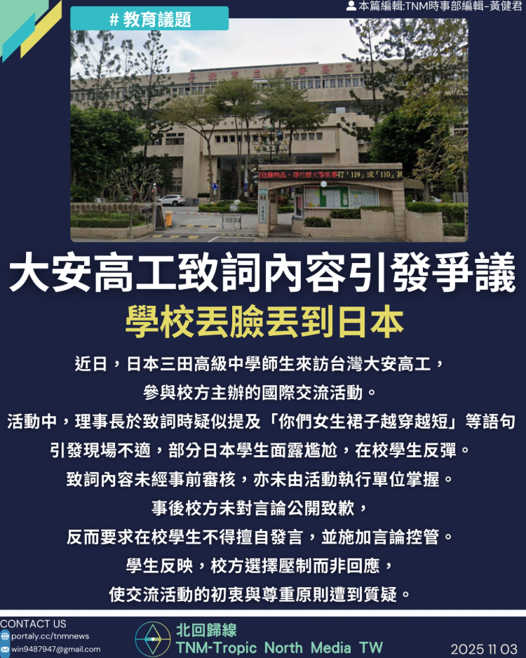

# 【大安高工致詞內容引發爭議，引發日本學生反感】

📅 2025年11月3日  
✍️ 黃健君｜TNM校園國際交流觀察

---

近日，日本三田高級中學師生來訪台灣大安高工，  
參與校方主辦的國際交流活動。

---

## 致詞內容引發不適　學生反彈

- 活動中，理事長致詞疑似提及「你們女生裙子越穿越短」等語句  
- 引發現場不適，部分日本學生面露尷尬  
- 在校學生亦表達反彈與不滿

---

## 致詞未經審核　校方未公開致歉

- 致詞內容未經事前審核，亦未由活動執行單位掌握  
- 事後校方未對言論公開致歉  
- 反而要求在校學生不得擅自發言，並施加言論控管

---

## 學生質疑：交流初衷遭扭曲

學生反映：

- 校方選擇壓制而非回應  
- 使交流活動的初衷與尊重原則遭到質疑

---

## 校方回應：確有不當言論，但非網傳語句

- 校方坦承當日確實有不恰當言論出現  
- 但並非「你們女生裙子越穿越短」之語句  
- 表示提醒學生不要擴散，是擔心以訛傳訛導致事件偏頗

---

> 「交流不是展示，而是尊重。」  

