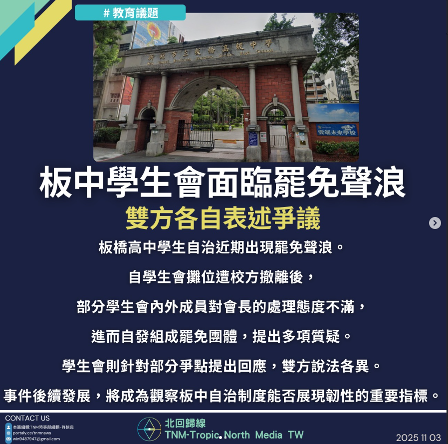
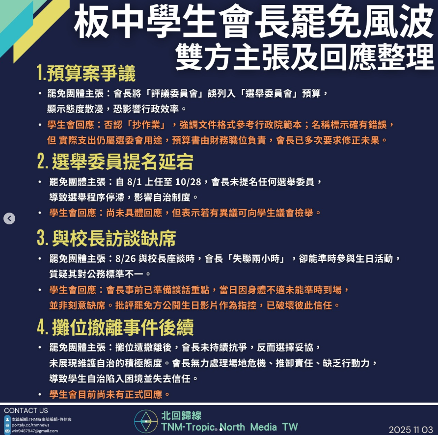

# 【板中學生會長面臨罷免聲浪，雙方各自表述爭議】

📅 2025年11月3日  
✍️ 許信良｜TNM校園民主觀察

---

板橋高中學生自治近期出現罷免聲浪。  
自學生會攤位遭校方撤離後，  
部分學生會內外成員對會長的處理態度不滿，  
進而自發組成罷免團體，提出多項質疑。

---

## 學生會與罷免團體各自表述

- 學生會針對部分爭點提出回應  
- 罷免團體則持續推動連署與公開說明  
- 雙方說法各異，校園內部意見分歧

---

## 不只是個人領導風格的檢驗

這場罷免風波不僅是針對個人領導風格的檢驗，  
也反映學生自治在校園中所面臨的挑戰：

- 如何在制度內與校方互動  
- 如何維持自治組織的信任與正當性

---

## 後續發展將成制度韌性指標

事件後續發展，  
將成為觀察板中自治制度能否展現韌性的重要指標。

---

> 「自治不是完美，而是面對爭議的勇氣。」  
> —— TNM學生自治評論部

