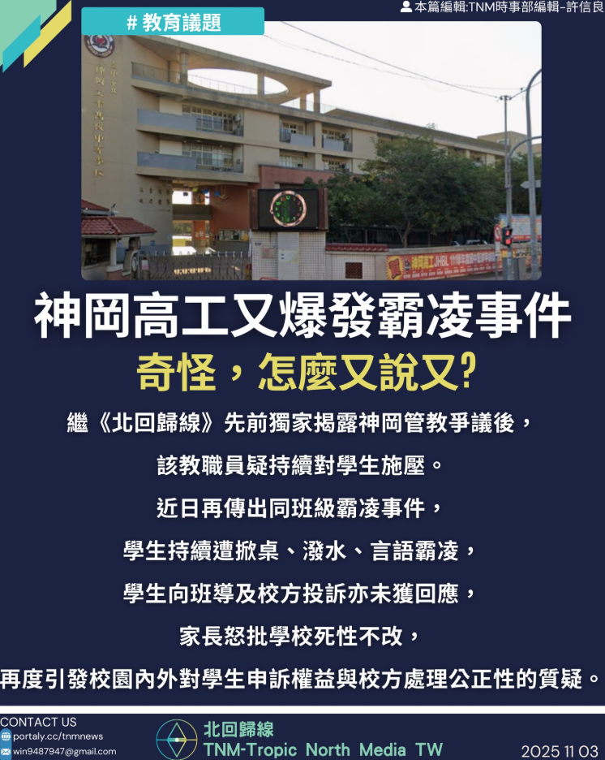
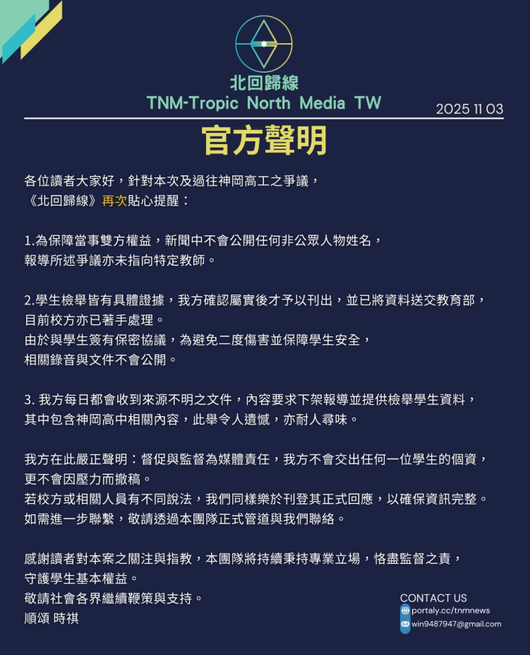

# 【神岡高工再爆教職員霸凌爭議，奇怪，怎麼又說又？】

📅 2025年11月3日  
✍️ 許信良｜校園人權與媒體責任觀察

---

繼《北回歸線》先前獨家揭露管教爭議後，  
神岡高工同一教職員疑持續對學生施壓。  
近日再傳出同班級霸凌事件：

- 學生遭掀桌、潑水、言語霸凌  
- 向班導及校方投訴未獲回應  
- 家長怒批學校「死性不改」

---

## 校園申訴機制遭質疑

此事件再度引發校園內外對：

- 學生申訴權益  
- 校方處理公正性  

的強烈質疑。

---

## 媒體聲明：不撤稿、不交個資

《北回歸線》貼心提醒：

- 為保障當事人權益，報導不公開任何非公眾人物姓名  
- 所有檢舉皆有具體證據，經查證屬實後刊出  
- 資料已送交教育部

媒體每日收到多份來源不明文件，要求：

- 下架報導  
- 提供檢舉學生資料

對此，我方嚴正聲明：

- 督促與監督為媒體責任  
- 不會交出任何學生個資  
- 更不會因壓力而撤稿

---

## 歡迎正式回應，確保資訊完整

若校方或相關人員有不同說法，  
我方同樣樂於刊登其正式回應，  
以確保資訊完整、公正。

---

> 「守護學生，不是立場，而是責任。」  
> —— TNM校園人權評論部

---

📮 如需進一步聯繫，敬請透過本團隊正式管道與我們聯絡。  
🙏 感謝讀者對本案之關注與指教，  
本團隊將持續秉持專業立場，恪盡監督之責，守護學生基本權益。  
敬請社會各界繼續鞭策與支持。

順頌 時祺。

